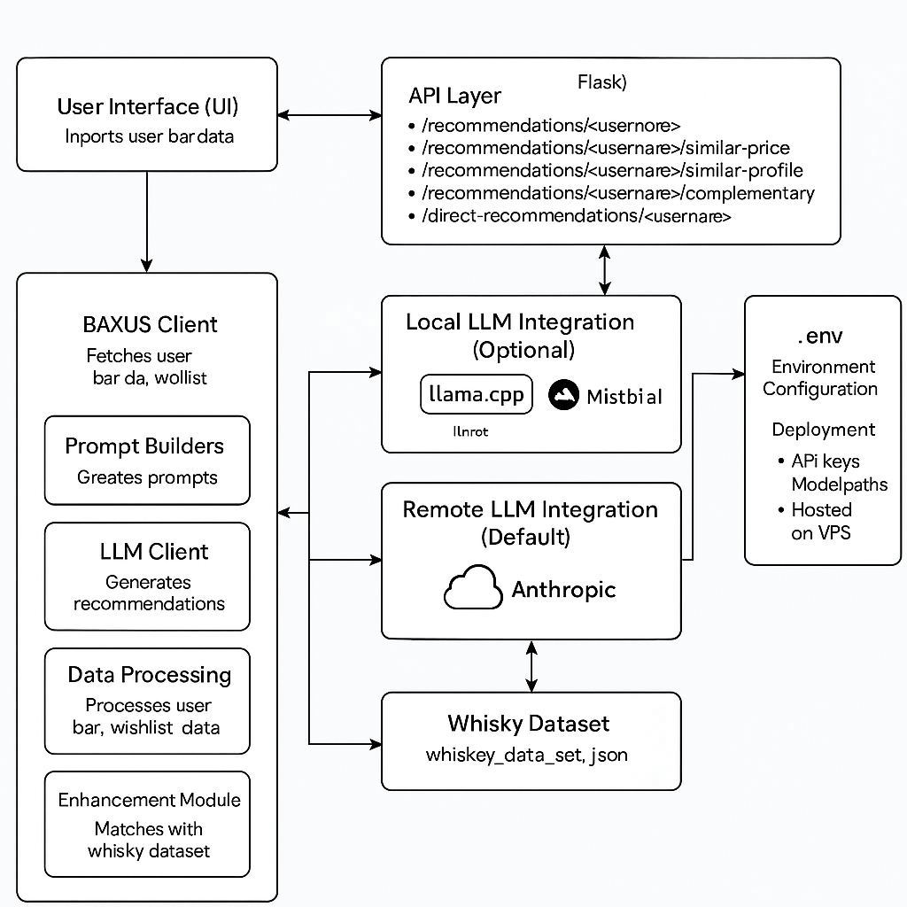

# Bob Whisky Recommender

## Overview
Bob is an AI-powered whisky expert designed to analyze users' virtual bars within the BAXUS ecosystem and provide personalized bottle recommendations. Bob leverages advanced machine learning techniques to identify patterns in user preferences and suggest bottles that align with their tastes, diversify their collections, or fit within specific price ranges.

### Objectives
- **Collection Analysis**: Parse and analyze users' existing bar data to identify patterns in preferences (e.g., regions, styles, price points, age statements).
- **Recommendation Engine**: Suggest new bottles based on collection analysis, including:
  - Bottles with similar profiles to the existing collection.
  - Complementary bottles to diversify the collection.
  - Recommendations within similar price ranges.

### Why This Approach is Optimal
1. **Personalization**: Bob uses advanced AI/ML models to provide highly personalized recommendations, ensuring relevance and user satisfaction.
2. **Scalability**: The architecture is designed to handle large datasets and multiple users simultaneously.
3. **Flexibility**: The system supports integration with various APIs and can adapt to different datasets or user requirements.
4. **Cost Efficiency**: While the preview version uses a paid Anthropics LLM endpoint, the production version is designed to use a private LLM, reducing long-term costs and enhancing data privacy.

### Comparison to Other Solutions
- **Rule-Based Systems**: These lack the adaptability and personalization of AI-driven recommendations.
- **Generic Recommendation Engines**: Unlike Bob, these do not specialize in whisky and cannot provide the same level of domain-specific expertise.

## Current Deployment
The preview version is hosted on a VPS with HTTPS enabled via DuckDNS using the DNS-01 challenge (no port 80 required). This setup ensures secure and reliable access for users.

### VPS and DuckDNS Setup
1. **DNS-01 Challenge**: Used to enable HTTPS without requiring port 80.
2. **DuckDNS**: Provides a free dynamic DNS service to map the VPS IP to a domain.
3. **Certbot**: Automates the process of obtaining and renewing SSL certificates.

### Future Production Enhancements
- **Private LLM**: The production system will integrate a private LLM to:
  - Eliminate reliance on paid public endpoints.
  - Preserve user data privacy.
  - Reduce operational costs.
- **Code for Private LLM**: Already included in the repository but not used in the preview due to high initial setup costs. We tested it locally with Tiny-llama models and it worked but was too slow for preview (VPS specs related)

## Debugging and Production Practices
- **Debugging**:
  - Extensive logging for API requests and responses.
  - Unit tests for core functionalities.
  - Mock datasets for testing recommendation logic.
- **Production Changes**:
  - Enhanced security measures (e.g., encrypted data storage).
  - Optimized API calls to reduce latency.
  - Scalable infrastructure to handle increased user load.

## Project Structure
```
project-root/
├── api/                # API integration logic
├── data/               # Dataset of 501 bottles
├── llama.cpp/          # Contains the model information
├── models/             # Machine learning models
├── src/                # Contains the implementations
├── .env.example        # Environment variable template
├── api.py       
├── app.py       
├── config.py        
└── README.md          
└── recommendations.json          
└── requirements.txt     
```

## Setup Instructions For Public LLM 
1. **Clone the Repository**:
   ```bash
   git clone https://github.com/your-repo/bob-whisky-recommender.git
   cd bob-whisky-recommender
   ```

2. **Install Dependencies**:
   ```bash
   pip install -r requirements.txt
   ```

3. **Configure Environment Variables**:
   - Copy `.env.example` to `.env`.
   - Update the API keys and URLs as needed.

4. **Run the Application**:
   ```bash
   python api.py
   ```

5. **Access the API**:
   - Use the provided endpoint to retrieve bar data:
     ```bash
     curl -X GET "http://services.baxus.co/api/bar/user/{{ username }}" \
          -H "Content-Type: application/json"
     ```

## Setup Instructions for Local LLM (Mistral)

To use the local LLM (Mistral) for recommendations, follow these steps:

1. **Install llama.cpp**:
   - Clone the `llama.cpp` repository from GitHub:
     ```bash
     git clone https://github.com/ggerganov/llama.cpp.git
     cd llama.cpp
     make
     ```
   - This will compile the necessary binaries for running Mistral models locally.

2. **Download the Mistral Model**:
   - Obtain the Mistral model weights from a trusted source. Ensure the model is compatible with `llama.cpp`.
   - Place the model file (e.g., `mistral.bin`) in a directory accessible to your project, such as `models/`.

3. **Configure the Environment**:
   - Update your `.env` file to include the path to the Mistral model:
     ```env
     LLM_MODEL_PATH=models/mistral.bin
     ```

4. **Modify the Code to Use Local LLM**:
   - Ensure the application is configured to use `llama.cpp` for inference. Update the relevant sections in your code to load the model from the path specified in the `.env` file.

5. **Run the Application with Local LLM**:
   - Start the application as usual:
     ```bash
     python api.py
     ```
   - The system will now use the local Mistral model for generating recommendations.

6. **Performance Considerations**:
   - Running the Mistral model locally may require significant CPU or GPU resources. Ensure your system meets the requirements for optimal performance.
   - For faster inference, consider using a machine with AVX2 or AVX512 support.

7. **Testing the Local LLM**:
   - Use mock datasets or sample API requests to verify the recommendations generated by the local model.

> **Note**: The `llama.cpp` folder is not included in the repository. Users must download and set it up independently.

## Architectural Diagram


## Screenshots


## References
- **Dataset**: 501 bottles for recommendation.
- **API Documentation**: [BAXUS API](http://services.baxus.co/api/docs).
- **BoozApp**: Add bottles to your bar for testing.

## Contributing
- Open PRs for new features or bug fixes.
